# 4. Test Plan and Test Cases

## 4.1 Test Strategy

Testing covers all main functions: create ensemble, add/modify/delete musician, undo/redo, and display functions.

Each test case includes test ID, input steps, expected result, and screenshot.

---

## 4.2 Test Cases

### TC001: Create Orchestra Ensemble
**Input:**
```
c → o → E001 → Symphony Orchestra
```
**Expected:** "orchestra ensemble is created." and becomes current ensemble

**Screenshot:** 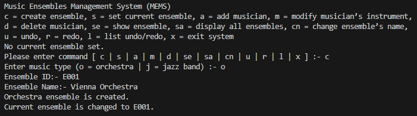

---

### TC002: Create Jazz Band Ensemble
**Input:**
```
c → j → J001 → Cool Jazz Band
```
**Expected:** "jazz band ensemble is created." and becomes current ensemble

**Screenshot:** 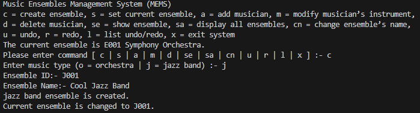

---

### TC003: Add Violinist to Orchestra
**Prerequisites:** Current ensemble is E001
**Input:**
```
a → M001, John Smith → 1
```
**Expected:** "Musician is added."

**Screenshot:** 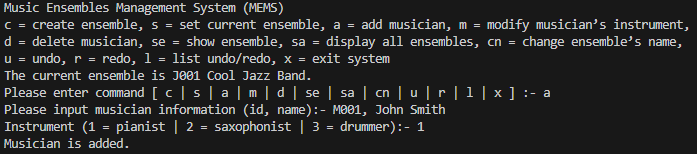

---

### TC004: Add Cellist to Orchestra
**Prerequisites:** Current ensemble is E001
**Input:**
```
a → M002, Mary Johnson → 2
```
**Expected:** "Musician is added."

**Screenshot:** 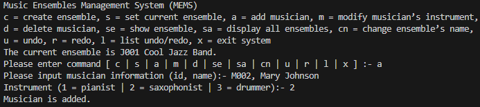

---

### TC005: Add Pianist to Jazz Band
**Prerequisites:** Set current to J001
**Input:**
```
s → J001
a → J001, Charlie Parker → 1
```
**Expected:** "Musician is added."

**Screenshot:** 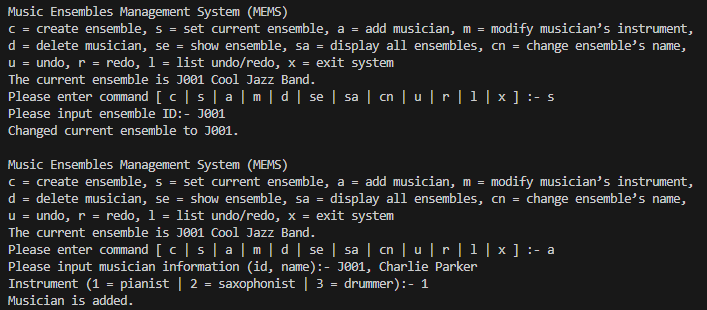

---

### TC006: Show Current Ensemble
**Prerequisites:** E001 has M001 (violinist) and M002 (cellist)
**Input:**
```
se
```
**Expected:** Display ensemble info with musicians listed by instrument

**Screenshot:** 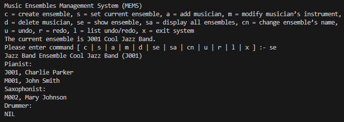

---

### TC007: Display All Ensembles
**Prerequisites:** E001 and J001 exist
**Input:**
```
sa
```
**Expected:** List all ensembles with type and name

**Screenshot:** 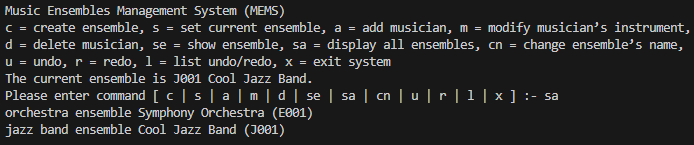

---

### TC008: Modify Musician's Instrument
**Prerequisites:** M001 is violinist in E001
**Input:**
```
m → M001 → 2
```
**Expected:** "instrument is updated." (M001 becomes cellist)

**Screenshot:** 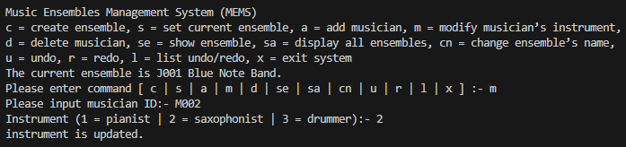

---

### TC009: Undo Modify Instrument
**Prerequisites:** Just modified M001 to cellist
**Input:**
```
u
```
**Expected:** "Command (...) is undone." (M001 back to violinist)

**Screenshot:** 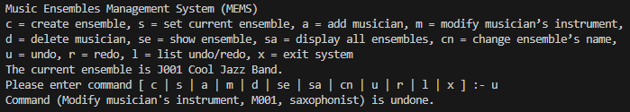

---

### TC010: Change Ensemble Name
**Prerequisites:** Current ensemble is E001
**Input:**
```
cn → Royal Symphony
```
**Expected:** "Ensemble's name is updated."

**Screenshot:** 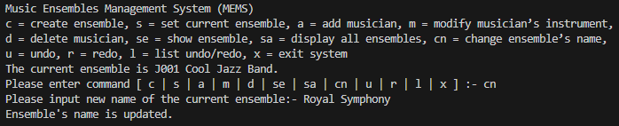

---

### TC011: Undo Change Name
**Prerequisites:** Just changed name
**Input:**
```
u
```
**Expected:** "Command (...) is undone." (name restored)

**Screenshot:** 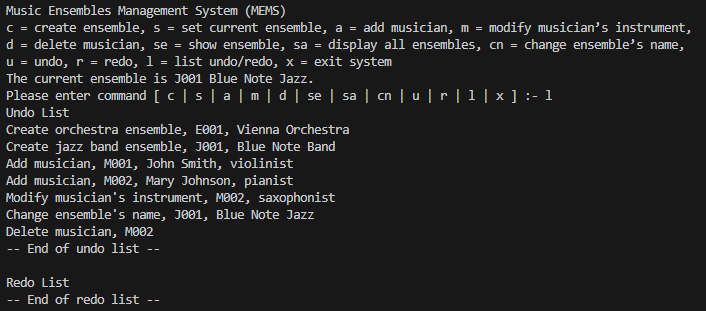

---

### TC012: Redo Operation
**Prerequisites:** Just did undo
**Input:**
```
r
```
**Expected:** "Command (...) is redone."

**Screenshot:** 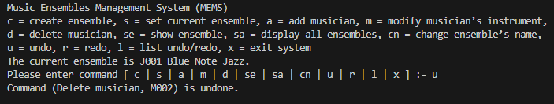

---

### TC013: List Undo/Redo
**Prerequisites:** Some commands executed
**Input:**
```
l
```
**Expected:** Show undo list and redo list

**Screenshot:** 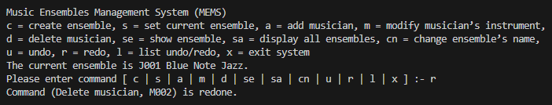

---

### TC014: Delete Musician
**Prerequisites:** M002 exists in E001
**Input:**
```
d → M002
```
**Expected:** "Musician is deleted."

**Screenshot:** 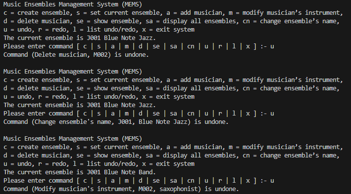

---

### TC015: Undo Delete
**Prerequisites:** Just deleted M002
**Input:**
```
u
```
**Expected:** "Command (...) is undone." (M002 restored)

**Screenshot:** 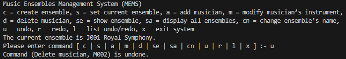

---

### TC016: Set Current Ensemble
**Prerequisites:** E001 and J001 exist
**Input:**
```
s → E001
```
**Expected:** "Changed current ensemble to E001."

**Screenshot:** 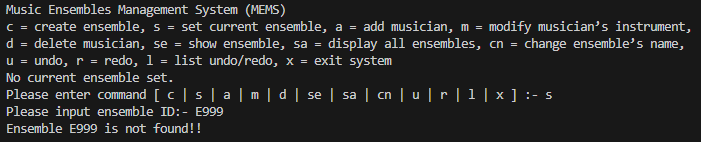

---

### TC017: Error - Invalid Ensemble Type
**Input:**
```
c → x → E999 → Test
```
**Expected:** "Invalid music type."

**Screenshot:** 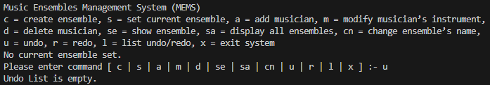

---

### TC018: Error - Musician Not Found
**Prerequisites:** Current ensemble is E001
**Input:**
```
m → M999
```
**Expected:** "Musician not found in current ensemble."

**Screenshot:** 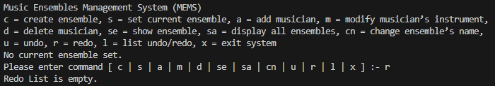

---

### TC019: Error - No Current Ensemble
**Prerequisites:** Start fresh system (no ensembles created yet)
**Input:**
```
a
```
**Expected:** "No current ensemble set."

**Note:** This test should be run at the beginning, before TC001.

**Screenshot:** 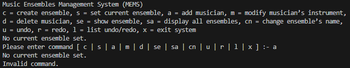

---

### TC020: Exit System
**Input:**
```
x
```
**Expected:** "Exiting system."

**Screenshot:** 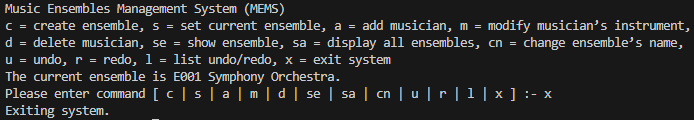

---

## 4.3 Summary

Total: 20 test cases covering all system functions.
